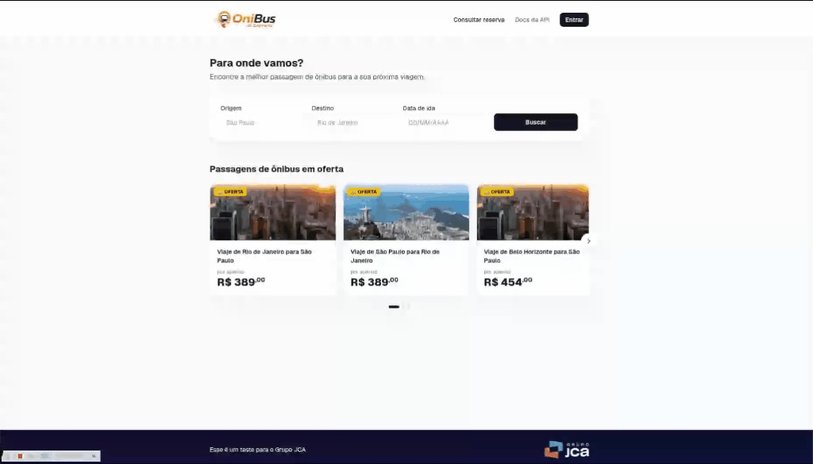
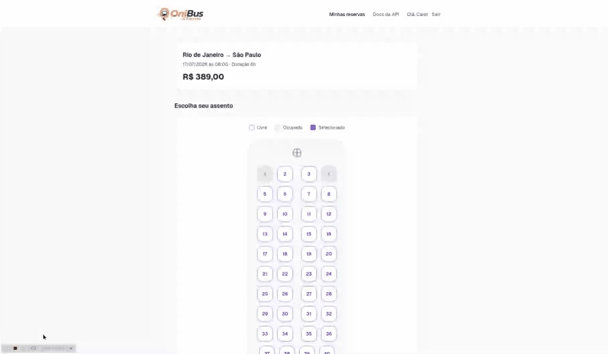
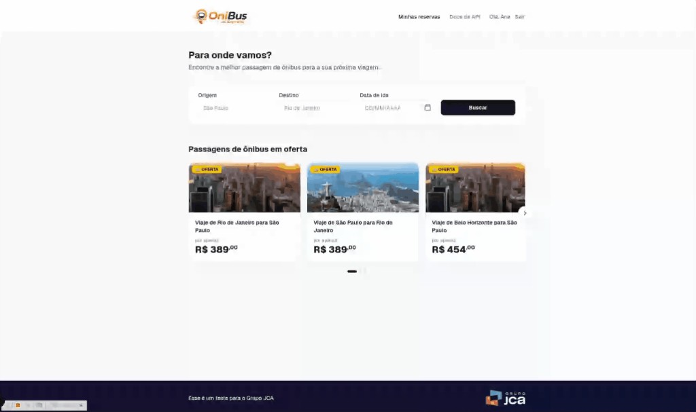
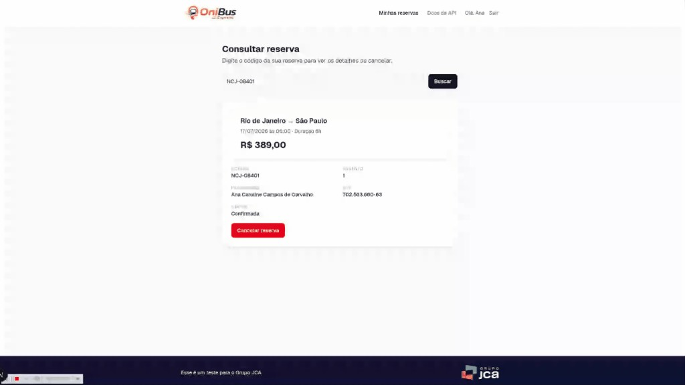

<p align="center">
  
</p>

<h1 align="center">🚌 OniBus Express</h1>

<p align="center">
  Sistema de venda de passagens rodoviárias: busca de viagens, seleção de assento, reserva com dados do passageiro e consulta/cancelamento por código.
</p>

O desafio original pedia um backend separado do frontend, mas como a vaga é focada em frontend, resolvi entregar tudo em um único projeto Next.js. O React continua sendo o motor da interface e as _Route Handlers_ do Next fazem o papel do backend, com a mesma separação em camadas (domínio, casos de uso, infraestrutura, API) que seria esperada em qualquer backend bem organizado. Isso deixou a entrega mais simples, com um único `npm install` e um único Docker, sem cortar nenhuma regra de negócio pedida.

## 📸 Capturas de tela

<table>
  <tr>
    <td align="center"><br />Busca de passagens + ofertas</td>
    <td align="center"><br />Seleção de assento</td>
  </tr>
  <tr>
    <td align="center"><br />Usuário logado (menu + calendário)</td>
    <td align="center"><br />Consulta e cancelamento de reserva</td>
  </tr>
</table>

## 🧱 Tecnologias e por quê

| Tecnologia                               | Onde         | Por quê                                                                                                                                                                              |
| ---------------------------------------- | ------------ | ------------------------------------------------------------------------------------------------------------------------------------------------------------------------------------ |
| **Next.js 16 (App Router) + TypeScript** | Full stack   | Um projeto só pra frontend e backend, com Server Components nas páginas e Route Handlers como API. Menos fricção do que manter dois repositórios e dois deploys pra um MVP.          |
| **React 19**                             | Frontend     | Componentes funcionais, sem classes.                                                                                                                                                 |
| **Prisma + SQLite**                      | Persistência | ORM tipado, migrations versionadas e banco em arquivo, sem precisar de infraestrutura extra pra rodar localmente ou em Docker. Pra trocar por Postgres basta mudar o `DATABASE_URL`. |
| **@tanstack/react-query**                | Frontend     | Cache, estados de loading/erro, invalidação e optimistic update já resolvidos, sem precisar de um Redux ou Context manual pra dados assíncronos.                                     |
| **Zod**                                  | Backend      | Validação de entrada nas rotas de API, reaproveitando as mensagens de erro direto na resposta HTTP.                                                                                  |
| **Tailwind CSS v4**                      | Frontend     | Estilização utilitária rápida e responsiva.                                                                                                                                          |
| **Jest + Testing Library**               | Testes       | Testes de unidade e integração no backend, e testes de comportamento (não de implementação) nos componentes React.                                                                   |
| **Docker + docker-compose**              | Deploy local | Sobe a aplicação inteira com um comando só, já aplicando as migrations.                                                                                                              |

## 🏗️ Decisões de arquitetura

- **Camadas separadas no backend**: `src/domain` tem as regras puras, sem depender de nada externo. `src/application` tem os casos de uso, que só conhecem interfaces de repositório. `src/infrastructure` implementa essas interfaces com Prisma. `src/app/api` fica só com a parte HTTP (validar entrada, chamar o caso de uso, devolver resposta). Detalhes em [`docs/BACKEND.md`](docs/BACKEND.md).
- **Sem classes em lugar nenhum do código**: toda a lógica é função pura ou função fábrica que devolve um objeto, incluindo os repositórios do Prisma e os erros de domínio (que usam `Object.assign` sobre um `Error` de verdade em vez de `class extends Error`). TypeScript em modo `strict`, sem `any`.
- **Páginas finas, componentes com a lógica**: as páginas em `src/app/**/page.tsx` só leem `params`/`searchParams`. Toda a interatividade fica em `src/components`. Detalhes em [`docs/FRONTEND.md`](docs/FRONTEND.md).
- **Assento escolhido guardado na URL**: a navegação entre a tela de assento e a de dados do passageiro usa query string (`?assento=5`). Assim um refresh de página não perde a seleção, sem precisar de um estado global só pra isso.
- **Cadastro e login por e-mail e senha**: a conta é criada uma vez (nome, CPF, data de nascimento, e-mail, senha) e o login do dia a dia usa só e-mail e senha. Como esses dados já ficam salvos na conta, o formulário de passageiro é pré-preenchido pra quem está logado. Senha guardada com hash e salt (`crypto.scryptSync`), nunca em texto puro.

## ▶️ Como rodar a aplicação

### Com Docker

```bash
docker-compose up --build
```

Esse comando constrói a imagem, aplica as migrations, popula o banco com dados de exemplo e sobe a aplicação em [http://localhost:3000](http://localhost:3000).

Pra parar: `docker-compose down` (use `docker-compose down -v` se quiser apagar os dados também).

### Sem Docker

Pré-requisitos: Node.js 20+ e npm.

```bash
npm install
npm run db:migrate   # cria o banco SQLite e aplica as migrations
npm run db:seed      # popula rotas e viagens de exemplo
npm run dev           # http://localhost:3000
```

### Variáveis de ambiente

Só uma variável é necessária, já com um valor padrão em `.env` pra desenvolvimento local:

| Variável       | Descrição                                       | Padrão (dev)    |
| -------------- | ----------------------------------------------- | --------------- |
| `DATABASE_URL` | String de conexão do Prisma (SQLite em arquivo) | `file:./dev.db` |

## 📚 Documentação

- [`docs/BACKEND.md`](docs/BACKEND.md): arquitetura do backend, entidades, regras de negócio e endpoints.
- [`docs/FRONTEND.md`](docs/FRONTEND.md): arquitetura do frontend, telas e estratégia de dados com React Query.
- [`/docs`](http://localhost:3000/docs): Swagger UI com a especificação OpenAPI da API (com a aplicação rodando).

## 🧪 Como rodar os testes

```bash
npm test            # roda toda a suíte uma vez
npm run test:watch  # modo watch
```

Lint e formatação:

```bash
npm run lint          # ESLint (eslint-config-next)
npm run format        # Prettier, formata o projeto inteiro
npm run format:check  # só verifica, sem alterar arquivos
```

A suíte tem 76 testes e cobre:

- **Domínio**: validação de CPF (formato e dígito verificador), máscara e conversão de datas, geração/formato do código de reserva e hash/verificação de senha.
- **Casos de uso**, com repositórios fake em memória: criação de reserva (CPF inválido, viagem inexistente, assento ocupado, assento fora do intervalo, viagem já partida), cancelamento (reserva inexistente, já cancelada, dentro/fora da janela de 2 horas), cadastro de conta (nome, CPF, data de nascimento e senha inválidos, confirmação de senha, CPF/e-mail duplicados) e login (e-mail ou senha incorretos).
- **Integração com Prisma real** (SQLite em arquivo dedicado): criação de reserva, bloqueio de assento duplicado, cancelamento liberando o assento e busca por código.
- **Componentes de frontend** com Testing Library: formulário de busca, mapa de assentos (seleção e bloqueio de assento ocupado), formulário de passageiro (validação, incluindo pré-preenchimento pro usuário logado), cadastro e login (validação e integração com a API) e consulta/cancelamento de reserva (com optimistic update).

## 🔌 Endpoints da API

Todas as rotas abaixo vivem em `/api` (ex.: `GET /api/rotas`). Especificação completa em [`public/openapi.json`](public/openapi.json), navegável em `/docs` com a aplicação rodando.

| Método   | Rota                                  | Descrição                                                   |
| -------- | ------------------------------------- | ----------------------------------------------------------- |
| `GET`    | `/api/rotas`                          | Lista todas as rotas disponíveis                            |
| `GET`    | `/api/viagens?origem=&destino=&data=` | Busca viagens por origem, destino e data                    |
| `GET`    | `/api/viagens/{id}`                   | Detalhes de uma viagem, com assentos livres/ocupados        |
| `POST`   | `/api/reservas`                       | Cria uma reserva (nome, CPF, e-mail, viagem, assento)       |
| `GET`    | `/api/reservas/{codigo}`              | Consulta uma reserva pelo código                            |
| `DELETE` | `/api/reservas/{codigo}`              | Cancela uma reserva (até 2h antes da partida)               |
| `POST`   | `/api/auth/registrar`                 | Cria a conta (nome, CPF, data de nascimento, e-mail, senha) |
| `POST`   | `/api/auth/login`                     | Login por e-mail e senha                                    |
| `POST`   | `/api/auth/logout`                    | Encerra a sessão                                            |
| `GET`    | `/api/auth/me`                        | Retorna o usuário logado (ou `null`)                        |
| `GET`    | `/api/minhas-reservas`                | Lista as reservas do usuário logado                         |

## ✅ Requisitos do desafio atendidos

<details open>
<summary><strong>Entidades e regras de negócio</strong></summary>

- [x] Rota, Viagem, Passageiro e Reserva/Passagem, com todos os campos pedidos.
- [x] Não é possível reservar um assento já ocupado.
- [x] Não é possível reservar passagem para viagem já realizada.
- [x] CPF validado (formato e dígito verificador).
- [x] Código de reserva único e legível (`ABC-12345`).
- [x] Cancelamento só permitido até 2 horas antes da partida.

</details>

<details open>
<summary><strong>Backend</strong></summary>

- [x] TypeScript com tipagem estrita em todo o backend.
- [x] Prisma como ORM, com banco relacional (SQLite; troca de `DATABASE_URL` migra pra Postgres).
- [x] Docker e docker-compose sobem a aplicação com um comando só.
- [x] Testes automatizados unitários e de integração.
- [x] Todos os 6 endpoints mínimos pedidos.

</details>

<details open>
<summary><strong>Frontend</strong></summary>

- [x] React com TypeScript.
- [x] Gerenciamento de estado: React Query pra dados de servidor e `useState` local pros formulários, sem precisar de Redux/Zustand no tamanho atual do projeto.
- [x] Testes com Jest e React Testing Library.
- [x] Docker serve a aplicação (mesmo container do backend, já que é um app só).
- [x] Tela 1: busca (origem, destino, data, loading, "sem resultados").
- [x] Tela 2: seleção de assento, com mapa visual livre/ocupado/selecionado e resumo da viagem.
- [x] Tela 3: dados do passageiro, validação no frontend, resumo da compra e tela de sucesso com o código.
- [x] Tela 4 (bônus): consulta de reserva por código e cancelamento.

</details>

<details open>
<summary><strong>Bônus entregues</strong></summary>

- [x] Backend e frontend integrados no mesmo projeto.
- [x] README completo (este arquivo).
- [x] Swagger/OpenAPI em [`/docs`](http://localhost:3000/docs).
- [x] Tratamento de erros e feedback visual (toasts, estados de loading/vazio, optimistic update).
- [x] Cadastro e login por e-mail/senha, com sessão e pré-preenchimento do passageiro logado.

</details>
